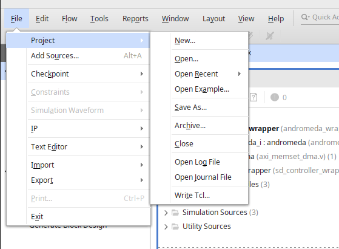

# Vivado Project Customization

## For Custom HDL module(s)

1. Place the HDL module(s) in a *hdl* directory
2. Open the Vivado xpr project in Vivado, add the hdl module(s), connect accordingly, validate block diagram, verify synthesis, implementation and P&R stage till bitstream generation.
3. Go to **FILE --> Project --> Write tcl** 
4. Add the relevant part of the tcl script to the **build_{TARGET}.tcl** script where TARGET=alinx|puzhi

